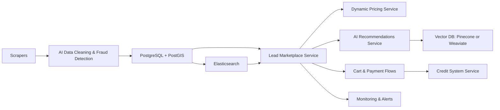

# AIQLeads Documentation

## Overview
AIQLeads is an innovative lead marketplace designed for real estate professionals. It leverages advanced AI features to provide geospatial search, dynamic pricing, and AI-driven recommendations. The platform is optimized for efficient and scalable lead management, targeting high-demand real estate markets.

For detailed documentation, please refer to:
- [MVP Overview](docs/MVP_Overview.md) - Current features and development roadmap
- [Architecture](docs/Architecture.md) - Technical design and system architecture
- [Market Insights](docs/MarketInsights.md) - Target markets and data sources
- [Full Documentation](docs/README.md) - Complete documentation index

---

## Repository Information

### Repository Link
[AIQLeads Repository](https://github.com/YourlocalJay/AIQLeads)

### Key Files for Review
1. **Project Configuration**:
   - `src/config/settings.py`: Environment configuration and logging.
   - `.env.example`: Template for environment variables.
2. **Documentation**:
   - `docs/Architecture.md`: High-level design and technical architecture.
   - `docs/MarketInsights.md`: Target markets and data strategies.
   - `docs/MVP_Overview.md`: Features and development roadmap.
3. **API and Core Services**:
   - `src/main.py`: FastAPI application entry point.
   - `src/api/v1/endpoints/`: Directory for all API route definitions.
   - `src/services/`: Core business logic modules.
4. **Database Models and Management**:
   - `src/models/`: SQLAlchemy models defining schema.
   - `migrations/`: Alembic migrations for database schema changes.
5. **Testing**:
   - `tests/unit/`: Unit tests for individual components.
   - `tests/integration/`: Integration tests for system components.

---

# Architecture

## 1. High-Level Design

AIQLeads uses a **modular, service-oriented approach** within a single repository, allowing each major feature to be developed and tested independently.

### Key Components
1. **Data Aggregation (Scrapers & Parsers)**
   - Pulls leads from multiple sources (Zillow, Craigslist, Facebook, FSBO, LinkedIn).
   - Region-specific scrapers for Las Vegas, Dallas/Ft. Worth, Austin, Phoenix.
2. **AI Services**
   - Data cleaning, fraud detection, dynamic pricing, and lead recommendations using LLMs and vector databases.
3. **Core Services**
   - **Cart Management**, **Credit System**, **Subscription Tiers**, and **Market Insights**.
4. **Storage & Search**
   - **PostgreSQL** with **PostGIS** for geospatial queries.
   - **Redis** for in-memory caching and cart timers.
   - **Elasticsearch** (or OpenSearch) for advanced text/faceted search.
5. **Monitoring & Alerts**
   - **Prometheus/Grafana** for metrics.
   - **alerts_service.py** for notifications on scraper downtime or system errors.

---

## 2. Data Flow



---

## 3. Key Design Principles

1. **Scalability**:
   - Modular scrapers allow easy addition of new regions.
   - AI-powered services scale independently to handle increasing leads and user traffic.

2. **Performance**:
   - Redis ensures low-latency caching for cart timers and frequently accessed data.
   - PostgreSQL with PostGIS optimizes geospatial queries for location-based recommendations.

3. **Data Integrity**:
   - Fraud detection ensures data quality.
   - Real-time validation of user inputs and lead purchases prevents inconsistencies.

4. **Monitoring**:
   - Alerts and dashboards track system health, ensuring quick responses to issues.

---

## 4. Future Enhancements

1. **Expanded Scraping**:
   - Add international markets with new scraper modules.

2. **Enhanced Recommendations**:
   - Integrate reinforcement learning to refine recommendation algorithms based on user interactions.

3. **Real-Time Analytics**:
   - Develop real-time dashboards for agents to visualize market trends and lead performance.

4. **System Hardening**:
   - Strengthen security for API endpoints and sensitive user data.

---

# Market Insights

AIQLeads initially targets **Las Vegas**, **Dallas/Ft. Worth**, **Austin**, and **Phoenix**, each with unique real estate dynamics. Below are market-specific insights guiding scraper logic, fraud detection, and dynamic pricing.

---

## 1. Las Vegas

### 1.1 Market Profile
- High volume of short-term rental and investment properties near the Strip.
- Demand spikes around major events (e.g., trade shows, sports events).

### 1.2 Scraping Focus
- **las_vegas_scraper.py** collects listings near Las Vegas Boulevard and popular suburbs like Henderson.  
- Detect property flipping trends and ephemeral listings for short-term rentals.

### 1.3 Pricing & Recommendations
- Factor in seasonality (peak tourism months, major conferences).  
- Recommend properties with strong rental income potential.

---

## 2. Dallas/Ft. Worth

### 2.1 Market Profile
- Large, growing metro area with diverse neighborhoods.
- Strong job market in suburbs (Plano, Frisco) attracting families.

### 2.2 Scraping Focus
- **dallas_scraper.py** covers both urban and suburban listings.  
- Emphasize new construction in fast-expanding neighborhoods (Arlington, Fort Worth outskirts).

### 2.3 Pricing & Recommendations
- Use geospatial queries to highlight school districts.  
- Evaluate lead demand from corporate relocations (major companies opening HQs).

---

## 3. Austin

### 3.1 Market Profile
- Tech hub with rapidly rising home prices and limited inventory.  
- Downtown condos and suburban family homes both in high demand.

### 3.2 Scraping Focus
- **austin_scraper.py** targets core zip codes (78701, 78702) plus surrounding Round Rock or Cedar Park.  
- LinkedIn scraper integration can capture property postings in tech job networks.

### 3.3 Pricing & Recommendations
- Factor in proximity to tech campuses (e.g., the Domain area, Tesla or Apple facilities).  
- Suggest leads with dedicated home offices or co-working space potential.

---

## 4. Phoenix

### 4.1 Market Profile
- Popular for retirement communities and snowbird seasonal residents.
- High interest in single-family homes with pools or minimal yard maintenance.

### 4.2 Scraping Focus
- **phoenix_scraper.py** covers central Phoenix, suburbs like Scottsdale, Mesa, Chandler.
- Look for leads indicating active adult communities (Sun City, etc.).

### 4.3 Pricing & Recommendations
- Seasonal demand spikes in winter (influx of snowbirds).
- Emphasize properties with desert-friendly landscaping or energy-efficient features.

---

## 5. Cross-Market Observations

1. **Fraud & Quality Scoring**  
   - Each region has unique red flags:  
     - Las Vegas: Overlapping event rentals.  
     - DFW: Rapid listing turnover.  
     - Austin: Tech job relocation "phantom" listings.  
     - Phoenix: Seasonal churn of short-term rentals.

2. **Regional AI Embeddings**  
   - Train or fine-tune embeddings on area-specific property data to boost recommendation relevance.

3. **Localized Cart & Pricing Strategies**  
   - Shorter cart timers in high-competition zones (e.g., Austin).  
   - Higher dynamic price adjustments in tourist-heavy regions (Vegas, Phoenix during winter).

4. **Expansion**  
   - Modular scrapers and AI logic let us quickly add new markets.  
   - Reuse best practices in geospatial queries and pricing across regions.

---

## 6. Future Market Notes
- **LinkedIn Scraper**: Particularly useful in tech-heavy or corporate relocations (Austin, Dallas).  
- **International Expansion**: Potential for big-city coverage worldwide once domestic markets prove stable.

---

# Project Structure

```
AIQLeads/
├── src/
│   ├── __init__.py
│   ├── main.py
│   ├── config/
│   │   ├── __init__.py
│   │   └── settings.py
│   ├── database/
│   │   ├── __init__.py
│   │   └── postgres_manager.py
│   ├── models/
│   │   ├── __init__.py
│   │   ├── user_model.py
│   │   ├── lead_model.py
│   │   ├── transaction_model.py
│   │   ├── subscription_model.py
│   │   └── market_insight_model.py
│   ├── services/
│   │   ├── __init__.py
│   │   ├── auth_service.py
│   │   ├── lead_service.py
│   │   ├── pricing_service.py
│   │   └── recommendations_service.py
│   ├── api/
│   │   ├── __init__.py
│   │   ├── v1/
│   │   │   ├── __init__.py
│   │   │   ├── endpoints/
│   │   │   │   ├── __init__.py
│   │   │   │   ├── users.py
│   │   │   │   ├── leads.py
│   │   │   │   └── transactions.py
│   │   │   └── dependencies.py
│   │   └── middleware.py
│   └── utils/
│       ├── __init__.py
│       ├── validators.py
│       └── helpers.py
├── tests/
│   ├── __init__.py
│   ├── conftest.py
│   ├── unit/
│   │   ├── __init__.py
│   │   ├── test_user_model.py
│   │   ├── test_lead_model.py
│   │   ├── test_transaction_model.py
│   │   └── test_subscription_model.py
│   └── integration/
│       ├── __init__.py
│       └── test_alembic_migrations.py
├── migrations/
│   ├── env.py
│   ├── script.py.mako
│   └── versions/
│       └── initial_migration.py
├── docs/
│   ├── README.md
│   ├── Architecture.md
│   ├── ProjectStructure.md
│   ├── MVP_Overview.md
│   └── MarketInsights.md
├── requirements.txt
├── requirements-dev.txt
├── docker-compose.yml
├── Dockerfile
├── .env.example
├── .gitignore
├── README.md
└── UPDATE.md
```

---

