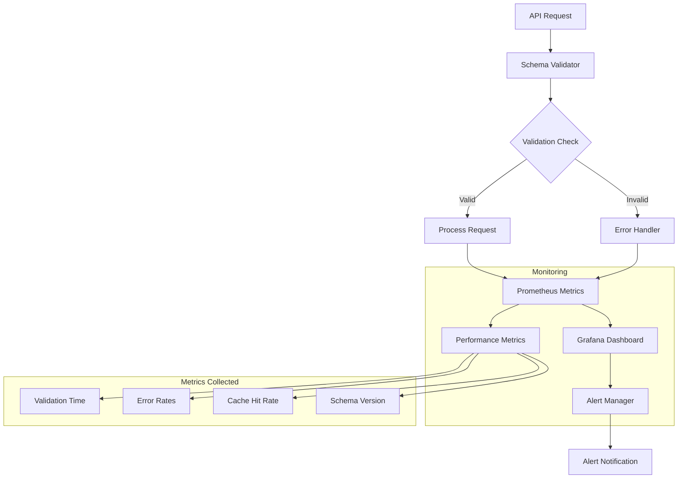

# AIQLeads Architecture

## Schema Monitoring

### Monitoring Infrastructure
- Prometheus metrics tracking schema validation performance
- Grafana dashboards for real-time monitoring
- Custom alerts for validation errors and performance degradation

### Monitoring Flow

### Key Metrics
- Schema validation processing time
- Validation error rates by endpoint
- Database query performance
- Schema version tracking
- Cache hit rates
- Alert frequency

### Alert Configuration
- Validation Time Threshold: 10ms
- Error Rate Threshold: 1%
- Cache Hit Rate Minimum: 85%
- Version Mismatch Detection

### Schema Change Management
- Automated schema migration tracking
- Version control integration
- Change impact analysis
- Rollback procedures
- Performance impact monitoring

### Dashboard Integration
- Real-time validation metrics
- Error rate visualization
- Performance trending
- Cache efficiency monitoring
- Version distribution tracking