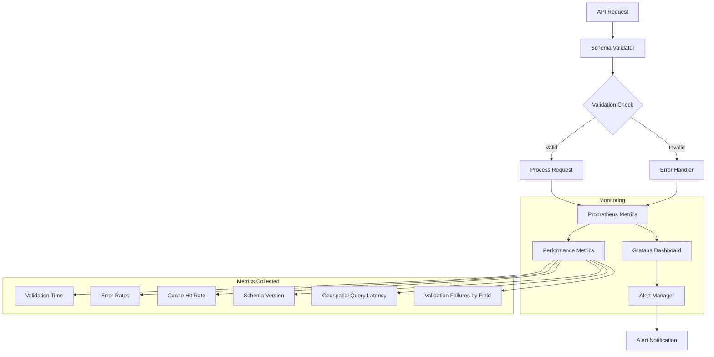

# AIQLeads Schema Monitoring

## Overview

Schema Monitoring in AIQLeads ensures the reliability, performance, and integrity of all schema validations and database interactions. It leverages advanced monitoring tools like **Prometheus**, **Grafana**, and **Alert Manager** to provide real-time metrics, actionable insights, and automated alerting mechanisms.

---

## Monitoring Infrastructure

### Tools Used:
- **Prometheus**: Tracks schema validation performance and other key metrics.
- **Grafana**: Provides real-time visualizations of schema monitoring data.
- **Alert Manager**: Sends notifications for validation errors, version mismatches, and performance degradation.
- **Redis**: Used for caching validation results and improving system performance.
- **Elasticsearch**: Tracks logs and schema-related changes for historical analysis.
- **PostGIS**: Enables geospatial query monitoring for location-based validations.

---

## Monitoring Flow



---

## Key Metrics

### Validation Metrics
- **Validation Time**: Measures the time taken for schema validations.
  - Example: 95th percentile below 10ms.
- **Validation Error Rates**: Tracks the proportion of failed validations per endpoint.
  - Example: <1% validation failures over 5 minutes.
- **Cache Hit Rate**: Tracks the percentage of validation requests served by Redis cache.
  - Example: Minimum target is 85% hit rate.

### Schema Integrity Metrics
- **Active Schema Versions**: Tracks deployed schema versions across environments.
- **Version Mismatches**: Detects discrepancies between API schema and database schema.
- **Migration Success Rate**: Tracks the success/failure of database migrations.

### Geospatial Validation Metrics
- **Geospatial Query Latency**: Monitors PostGIS query times for location-based validations.
  - Example: Queries should execute within 50ms.
- **Boundary Validation Errors**: Counts the number of invalid geospatial validations (e.g., out-of-bounds locations).

### Database Metrics
- **Query Performance**: Tracks the execution time of database queries triggered by schema validations.
- **Deadlocks and Lock Contention**: Identifies issues affecting schema update queries.

### Prometheus Metrics

```yaml
- name: Validation Time
  query: histogram_quantile(0.95, rate(schema_validation_duration_seconds_bucket[5m]))
  
- name: Error Rate
  query: sum(rate(validation_errors_total[1m])) / sum(rate(api_requests_total[1m]))
  
- name: Cache Hit Rate
  query: sum(cache_hits_total) / (sum(cache_hits_total) + sum(cache_misses_total))

- name: Geospatial Query Latency
  query: histogram_quantile(0.95, rate(postgis_query_duration_seconds_bucket[5m]))
```

---

## Alert Configuration

### Thresholds
- **Validation Time**: Alert if >10ms for over 1 minute.
- **Validation Error Rate**: Alert if >1% for over 5 minutes.
- **Cache Hit Rate**: Alert if <85% for over 10 minutes.
- **Geospatial Query Latency**: Alert if PostGIS queries exceed 100ms for over 5 minutes.

### Example Alert Rule (Prometheus)

```yaml
groups:
  - name: schema-monitoring
    rules:
      - alert: HighValidationErrorRate
        expr: sum(rate(validation_errors_total[1m])) / sum(rate(api_requests_total[1m])) > 0.01
        for: 5m
        labels:
          severity: warning
        annotations:
          summary: "High validation error rate detected"
          description: "Validation errors have exceeded 1% for the past 5 minutes."
      
      - alert: SlowGeospatialQuery
        expr: histogram_quantile(0.95, rate(postgis_query_duration_seconds_bucket[5m])) > 100
        for: 5m
        labels:
          severity: critical
        annotations:
          summary: "Geospatial query latency too high"
          description: "95th percentile of geospatial query latency exceeded 100ms."
```

---

## Schema Change Management

### Processes
- **Automated Migration Tracking**:
  - Use Alembic migrations for schema changes.
  - Track schema updates with version tags in Git.
- **Pre-Deployment Validation**:
  - Validate schema changes in a staging environment.
  - Run comprehensive tests for backward compatibility.
- **Rollback Procedures**:
  - Maintain migration rollback scripts for emergency reversions.
- **Post-Migration Monitoring**:
  - Monitor validation metrics immediately after schema updates.
  - Alert on performance degradation or increased error rates.

---

## Real-World Use Case Example

### Scenario: Validation Errors Spike Due to a Schema Update

1. **Issue Detection**:
   - Prometheus detects a sudden spike in validation errors.
   - Grafana dashboards show increased validation times and higher cache misses.
   - Alerts notify the engineering team.
   
2. **Immediate Actions**:
   - Rollback the schema using Alembic.
   - Investigate logs for root cause analysis (e.g., missing fields, mismatched versions).
   
3. **Resolution**:
   - Fix the schema issue and redeploy after thorough testing.
   - Update monitoring thresholds based on post-resolution performance metrics.

---

## Dashboard Panels (Grafana)

1. **Validation Time (95th Percentile)**:
   - Tracks validation performance trends.
2. **Error Rates by Endpoint**:
   - Highlights endpoints with the highest validation failures.
3. **Cache Efficiency**:
   - Monitors Redis cache hit/miss rates for schema validations.
4. **Geospatial Query Latency**:
   - Visualizes PostGIS query performance.
5. **Version Mismatch Trends**:
   - Tracks instances of schema discrepancies between API and database layers.

---

## Future Enhancements

1. **Anomaly Detection**:
   - Integrate machine learning to identify abnormal validation or query patterns.
   
2. **Extended Metrics**:
   - Add metrics for fraud detection performance during validation.
   
3. **Business Impact Analysis**:
   - Correlate validation issues with user retention and lead conversion rates.
   
4. **Visualization Enhancements**:
   - Build heatmaps for error-prone regions using geospatial metrics.

---

## Conclusion

AIQLeads’ Schema Monitoring framework combines robust validation, advanced geospatial capabilities, and real-time performance tracking to ensure schema reliability and operational efficiency. These tools and processes enable proactive detection and resolution of schema-related issues, providing a seamless experience for users and administrators
