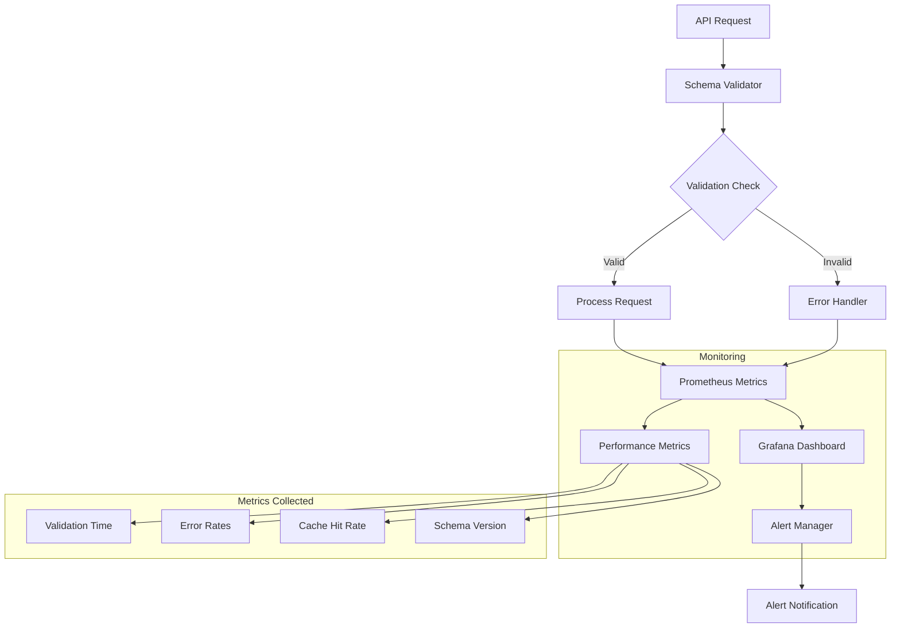

# AIQLeads Schema Monitoring

## Overview

Schema Monitoring in AIQLeads ensures the reliability, performance, and integrity of all schema validations and database interactions. It leverages advanced monitoring tools like Prometheus and Grafana to provide real-time metrics, actionable insights, and automated alerting mechanisms.

---

## Monitoring Infrastructure

- **Prometheus**: Tracks schema validation performance metrics.
- **Grafana**: Visualizes real-time schema monitoring data.
- **Alert Manager**: Sends alerts for validation errors or performance degradation.

---

## Monitoring Flow


---

## Key Metrics

### Validation Performance
- **Validation Time**: Time taken to validate incoming API requests.
- **Validation Error Rates**: Proportion of failed validations by endpoint.
- **Cache Hit Rate**: Percentage of requests served using the cache.

### Schema Integrity
- **Schema Version**: Tracks active schema versions.
- **Version Mismatches**: Detects discrepancies between API and database schemas.

### Database Impact
- **Query Performance**: Time taken for database operations triggered by schema validation.

### Example Prometheus Metrics
```yaml
# Prometheus query examples
- name: Validation Time
  query: histogram_quantile(0.95, rate(schema_validation_duration_seconds_bucket[5m]))
  
- name: Error Rate
  query: sum(rate(validation_errors_total[1m])) / sum(rate(api_requests_total[1m]))
  
- name: Cache Hit Rate
  query: sum(cache_hits_total) / (sum(cache_hits_total) + sum(cache_misses_total))
```

---

## Alert Configuration

### Thresholds
- **Validation Time**: Alert if >10ms for over 1 minute.
- **Error Rate**: Alert if >1% for over 5 minutes.
- **Cache Hit Rate**: Alert if <85% for over 10 minutes.

### Example Alert Rule (Prometheus)
```yaml
groups:
  - name: schema-monitoring
    rules:
      - alert: HighValidationErrorRate
        expr: sum(rate(validation_errors_total[1m])) / sum(rate(api_requests_total[1m])) > 0.01
        for: 5m
        labels:
          severity: warning
        annotations:
          summary: "High validation error rate detected"
          description: "Validation errors have exceeded 1% for the past 5 minutes."
```

---

## Schema Change Management

### Key Features
- **Automated Migration Tracking**: Tracks and applies schema changes via Alembic.
- **Version Control**: Git-based tracking ensures consistent schema updates across environments.
- **Rollback Procedures**: Reverts to previous schema in case of errors.
- **Performance Monitoring**: Detects performance degradation post-migration.

### Tools
- **Alembic**: For schema migrations.
- **DBMate**: For lightweight, cross-platform database migrations.
- **Git Hooks**: Ensure migrations are committed with code changes.

---

## Real-World Use Case Example

### Scenario: Schema Update Introduced a New Required Field

1. **Issue Detection**:
   - Prometheus detects a sudden spike in validation errors.
   - Grafana dashboards display increased validation times.
2. **Resolution**:
   - Rollback applied via Alembic to the previous schema version.
   - Alerts notify the team of the issue and resolution progress.
3. **Improvement**:
   - Cache hit rate and validation times return to normal thresholds.

---

## Dashboard Integration

### Real-Time Metrics

#### Validation Metrics
- Validation time distribution.
- Error rates by endpoint.

#### Schema Integrity
- Active schema versions.
- Mismatch detection rates.

### Example Dashboard Panels

1. **Validation Time (95th Percentile)**:
   - Displays API request validation performance.
2. **Error Rate by Endpoint**:
   - Identifies problematic endpoints causing validation failures.
3. **Cache Efficiency**:
   - Tracks the effectiveness of the schema validation cache.
4. **Query Latency**:
   - Visualizes database query times linked to schema operations.

---

## Conclusion

By combining schema validation, monitoring, and alerting, the AIQLeads platform ensures real-time visibility into schema health and performance. This architecture enables proactive error detection, fast troubleshooting, and continuous improvement in data integrity and validation efficiency.
