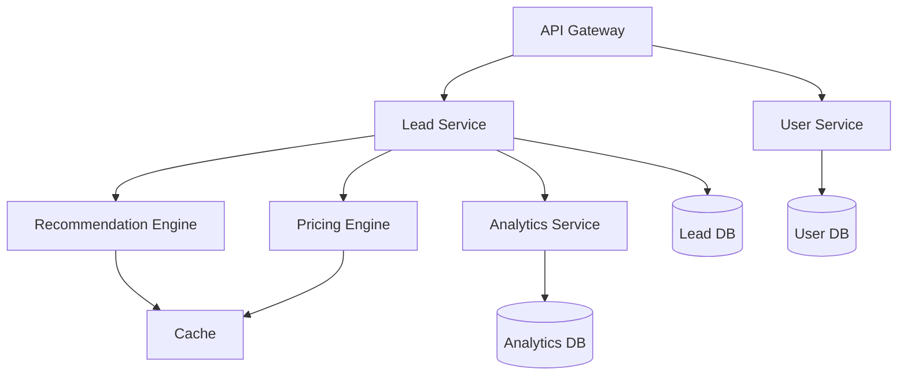

# System Architecture Design

## Architecture Patterns

### Microservices Architecture
- Lead Processing Service
- Recommendation Engine
- Pricing Service
- Analytics Service
- User Management Service

### Event-Driven Architecture
- Lead Events (Created, Updated, Enriched)
- User Events (Search, View, Purchase)
- System Events (Errors, Warnings, Info)
- Analytics Events (Metrics, KPIs)

### Layered Architecture
1. Presentation Layer
   - API Gateway
   - Web Interface
   - Mobile Interface

2. Business Layer
   - Lead Management
   - User Management
   - Recommendation Logic
   - Pricing Engine

3. Data Layer
   - Lead Repository
   - User Repository
   - Analytics Store
   - Cache Layer

## Component Interactions

### Service Communication


### Data Flow
1. Lead Ingestion
   ```mermaid
   sequenceDiagram
       Lead Source->>+API Gateway: Submit Lead
       API Gateway->>+Lead Service: Process Lead
       Lead Service->>+Validation: Validate
       Lead Service->>+Enrichment: Enrich
       Lead Service->>+Pricing: Calculate Price
       Lead Service->>+DB: Store
       Lead Service-->>-API Gateway: Confirmation
   ```

2. Recommendation Flow
   ```mermaid
   sequenceDiagram
       User->>+API Gateway: Request Recommendations
       API Gateway->>+Recommendation Engine: Get Recommendations
       Recommendation Engine->>+Cache: Check Cache
       Recommendation Engine->>+Lead DB: Fetch Data
       Recommendation Engine->>+Analytics: Get Insights
       Recommendation Engine-->>-API Gateway: Return Results
   ```

## Scalability Considerations

### Horizontal Scaling
- Stateless services
- Load balancing
- Service discovery
- Auto-scaling policies

### Vertical Scaling
- Resource optimization
- Memory management
- CPU utilization
- Storage efficiency

### Data Scaling
- Database sharding
- Read replicas
- Caching strategy
- Data partitioning

## Monitoring Implementation

### Infrastructure Monitoring
- Server health
- Network metrics
- Resource utilization
- Service availability

### Application Monitoring
- Request rates
- Response times
- Error rates
- Business metrics

### Log Aggregation
- Centralized logging
- Log correlation
- Search capabilities
- Retention policies

### Alerting System
- Alert thresholds
- Notification channels
- Escalation policies
- On-call rotations

## Security Architecture

### Authentication
- JWT tokens
- OAuth2 integration
- API keys
- Rate limiting

### Authorization
- Role-based access
- Resource ownership
- Permission hierarchy
- Access auditing

### Data Protection
- Encryption at rest
- Encryption in transit
- Data masking
- Key management

## Disaster Recovery

### Backup Strategy
- Database backups
- Configuration backups
- Code repository backups
- Recovery procedures

### Failover Procedures
- Service redundancy
- Database failover
- Load balancer failover
- DNS failover

## Performance Optimization

### Caching Strategy
- Application cache
- Database cache
- CDN integration
- Cache invalidation

### Query Optimization
- Index optimization
- Query analysis
- Connection pooling
- Statement caching

### Resource Management
- Connection limits
- Thread pool management
- Memory allocation
- Garbage collection