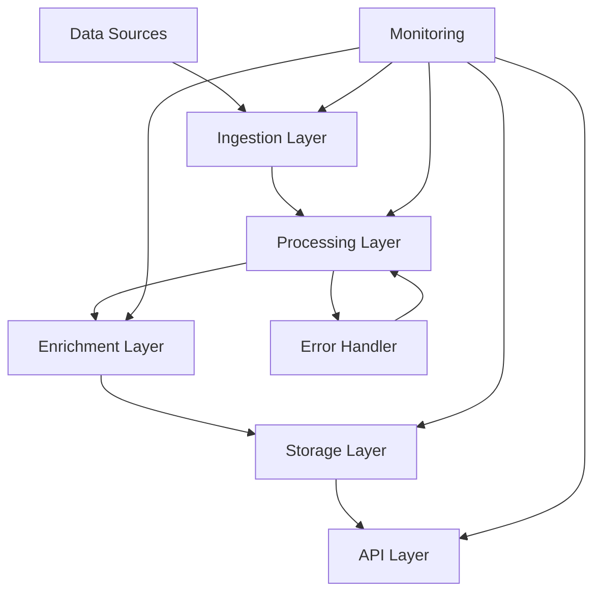

# Data Pipeline Documentation

This section covers the comprehensive documentation for AIQLeads data processing pipelines, including workflows, error handling, scaling patterns, and integration points.

## Overview

The AIQLeads pipeline system is designed to handle:
- Lead data ingestion and processing
- Data enrichment and validation
- AI-powered lead scoring and categorization
- Integration with external systems

## Key Components

1. [Processing Workflows](./processing_workflows.md)
   - Data ingestion patterns
   - Transformation steps
   - Validation processes
   - Output handling

2. [Error Handling](./error_handling.md)
   - Error detection strategies
   - Recovery mechanisms
   - Logging and monitoring
   - Alert systems

3. [Scaling Patterns](./scaling_patterns.md)
   - Horizontal scaling strategies
   - Load balancing
   - Resource optimization
   - Performance monitoring

4. [Integration Points](./integration_points.md)
   - API integrations
   - Third-party services
   - Data exchange formats
   - Authentication methods

## Pipeline Architecture

## Implementation Guidelines

1. All pipelines must implement standard monitoring hooks
2. Error handling should follow the defined patterns in error_handling.md
3. Each pipeline should be independently scalable
4. Data validation occurs at each stage

## Configuration

Pipeline configurations are managed through:
- Environment variables
- Configuration files
- Feature flags
- Dynamic settings

## Related Documentation

- [API Documentation](../../api/README.md)
- [Schema Documentation](../../schemas/README.md)
- [Monitoring Setup](../monitoring/README.md)
