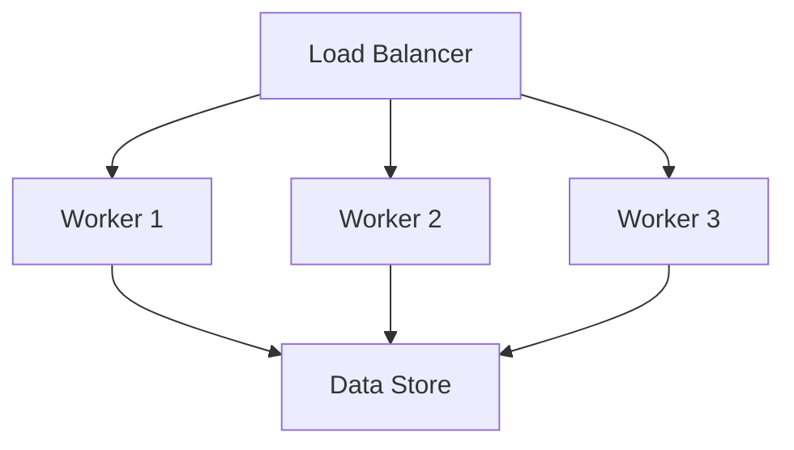

# Scaling Patterns

## Overview

AIQLeads implements various scaling patterns to ensure system performance and reliability under varying loads.

## Horizontal Scaling

### Worker Pools

- Dynamic worker allocation
- Load-based scaling
- Resource optimization
- Health monitoring

### Partitioning Strategies

1. **Data Partitioning**
   - Shard keys
   - Distribution patterns
   - Rebalancing mechanisms

2. **Processing Partitioning**
   - Task distribution
   - Resource allocation
   - Load balancing

## Performance Optimization

### Caching Strategies

1. **Result Caching**
   - Cache invalidation
   - TTL configuration
   - Memory management

2. **Computation Caching**
   - Intermediate results
   - Frequent computations
   - Resource-intensive operations

### Resource Management

- CPU allocation
- Memory limits
- Network bandwidth
- Storage IOPS

## Monitoring and Metrics

### Key Metrics

1. **System Metrics**
   - CPU utilization
   - Memory usage
   - Network throughput
   - Disk usage

2. **Application Metrics**
   - Request rates
   - Processing times
   - Error rates
   - Queue lengths

### Scaling Triggers

- Load thresholds
- Resource utilization
- Error rates
- Response times

## Implementation Guidelines

1. All components must be stateless
2. Use distributed caching
3. Implement retry mechanisms
4. Monitor scaling events
